# JSP 서버프로그램 구현 test

## 환경
- windows
- jdk1.8
- tomcat9.0
- sts tool
- mysql8.0
- postman
- lombok
- jstl
- 인코딩 utf-8

## MySQL 데이터베이스 생성 및 사용자 생성
```sql
create user 'testuser'@'%' identified by '1234';

grant all privileges on *.* to 'testuser'@'%';

create database test;
```

## MySQL 테이블 생성
```
CREATE TABLE user(
    id int primary key auto_increment,
    username varchar(10) not null unique,
    password varchar(20) not null,
    email varchar(30) not null,
    userRole varchar(10),
    createDate timestamp
)engine=InnoDB default charset=utf8;
```
<<<<<<< HEAD

## 간단명료 구현 내용
</br>

##### 초기화면 index.jsp
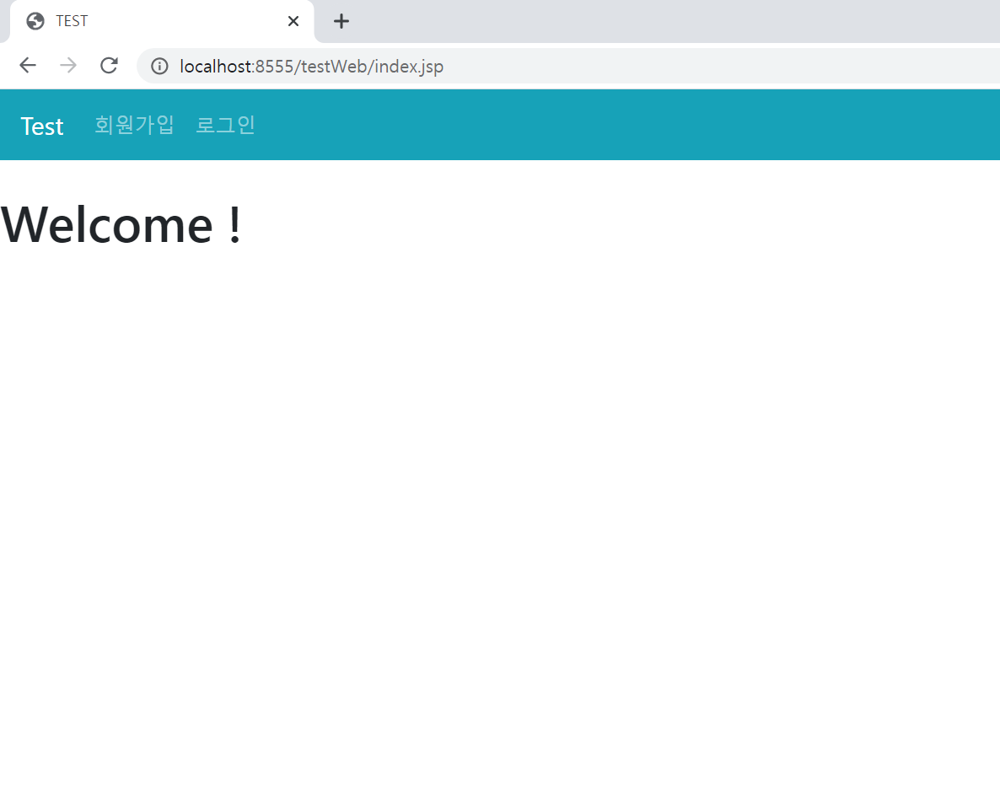</img>

##### 회원가입 joinForm.jsp

* 공백란 체크 

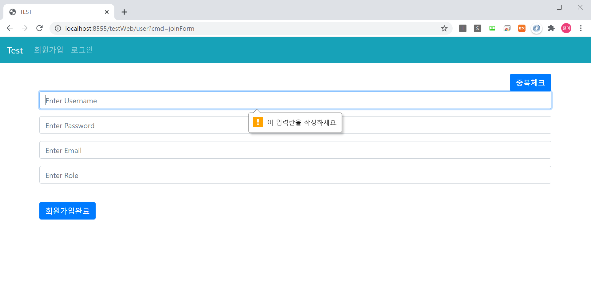</img>

* 아이디 중복 체크

</img> 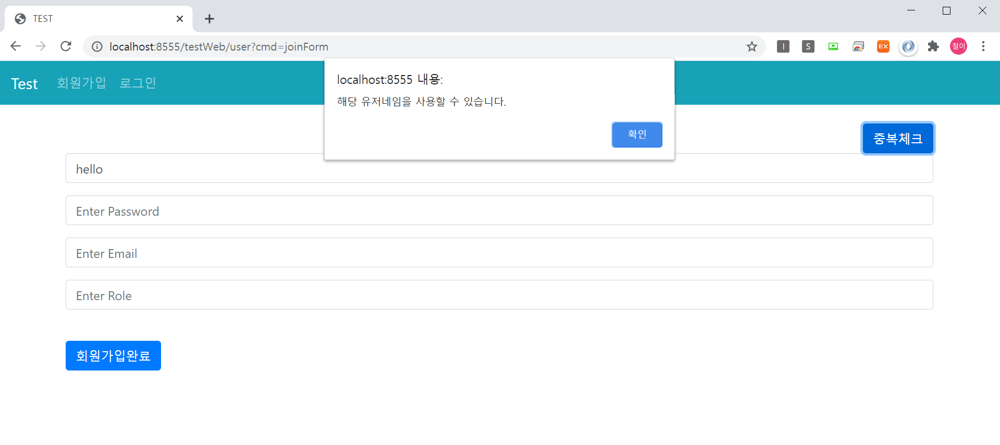</img>

##### 로그인 loginForm.jsp

* ID, PASSWORD 입력

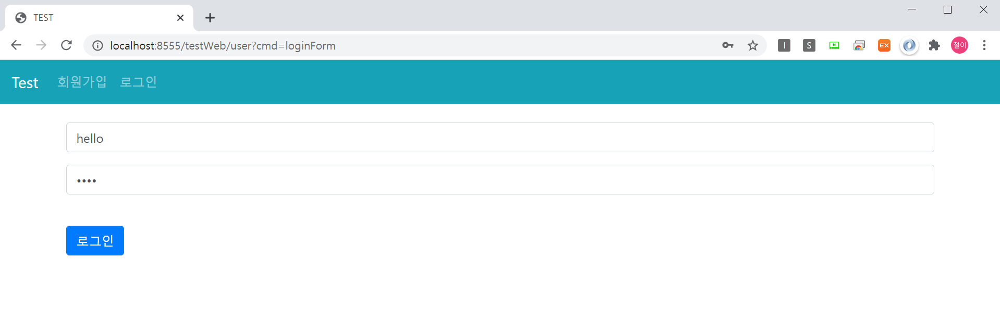</img>

* 로그인 완료시 session 체크 후 index.jsp로 sendRedirect 그리고 상단 bar 회원가입/로그인 => 회원목록/로그아웃 으로 변경

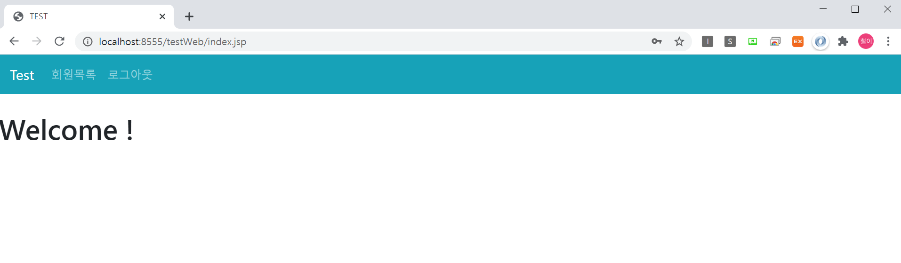</img>

##### 회원 목록 userList.jsp

* User 회원 목록

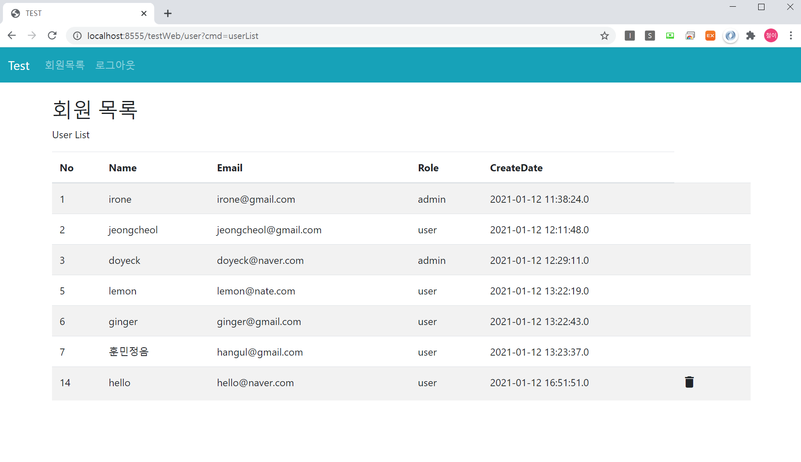</img>

* User 회원은 자신만 삭제 가능

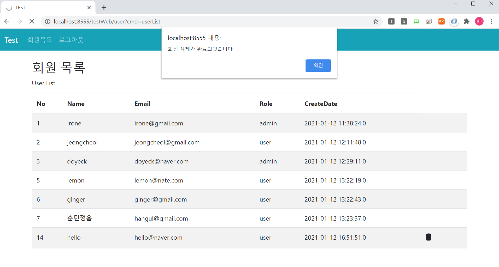</img>

* User 회원은 삭제 후 session을 잃은 후 index.jsp로 돌아감

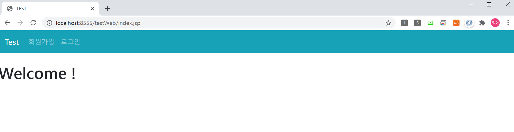</img>

* Admin 회원 목록

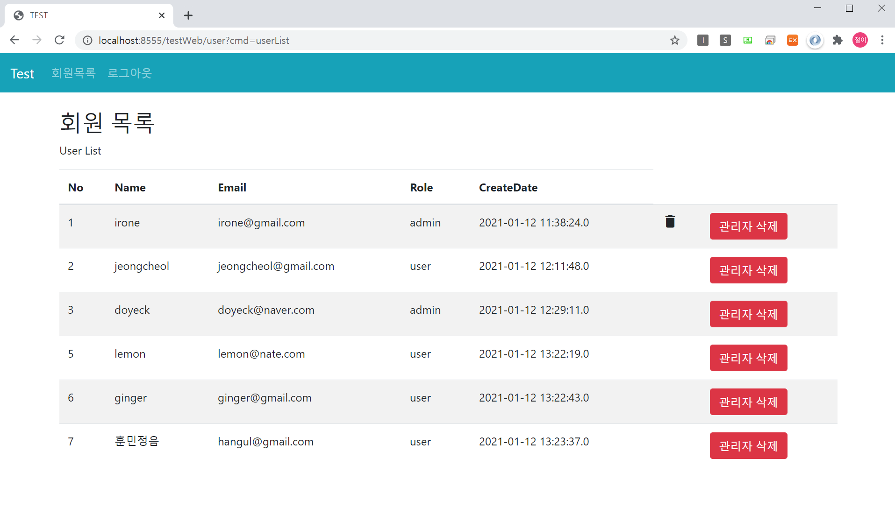</img>

* Admin 회원은 모든 회원을 삭제 가능

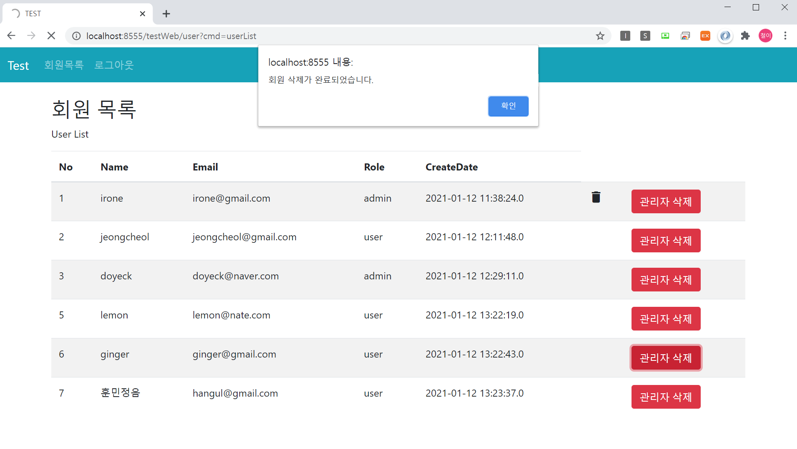</img>

* Admin 회원은 삭제 후 session을 잃지 않고 reload 된 후 유지

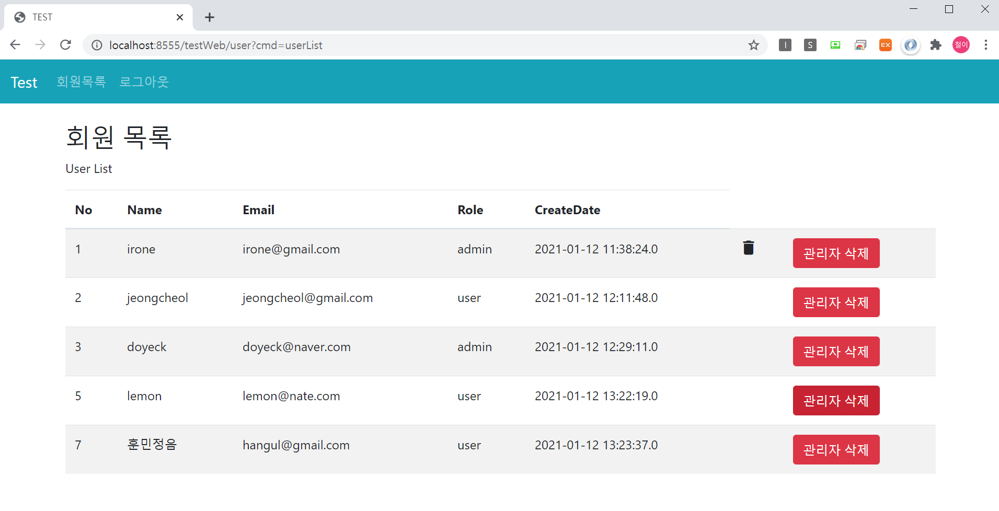</img>


##### 구성

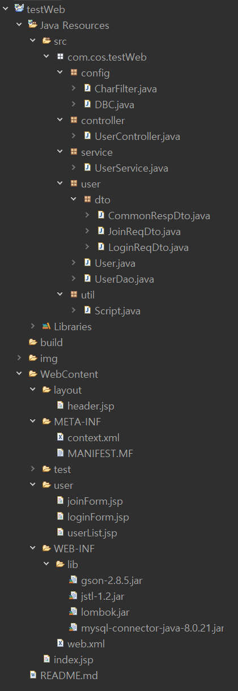</img>